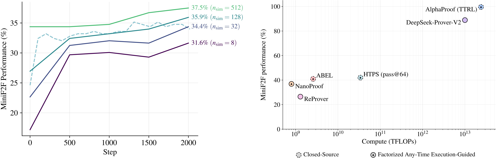

# nanoproof



This is an attempt to replicate AlphaProof / HyperTree Proof Search. It is based on [nanochat](https://github.com/karpathy/nanochat) and the
official AlphaProof pseudocode (together with several open-source datasets and tools). We have:
- pretraining on Nemotron-CC-Math (~20B tokens)
- midtraining on Lean code from GitHub (~65M tokens)
- supervised fine-tuning on LeanTree (~260k transitions extracted from Mathlib) - https://github.com/kripner/leantree
- tokenizer based on GPT-2, adapted for Lean
- interaction with Lean using LeanTree server
- MCTS-based prover
- evaluation on MiniF2F and Lean-Workbook
- fully distributed RL training
  - a GPU node for inference + DDP training + coordination
  - CPU nodes for actors (provers)
  - CPU nodes for the LeanTree servers

The best score achieved so far is **38.5% on MiniF2F**.


# Setup

```
cd nanoproof
uv sync --extra cpu --group dev
source .venv/bin/activate

hf auth login

python -m nanoproof.dataset
python -m scripts.tok_train
```

Pretrain:

```
python -m nanoproof.pretrain
```

or

```
torchrun --standalone --nproc_per_node=2 -m nanoproof.pretrain
```

Similarly with `nanoproof.midtrain` and `nanoproof.sft`.

# Running the RL Loop

The RL loop alternates between collecting proof transitions using MCTS and training the model.

## Web Monitor

When the RL loop starts, it launches a web monitor on port 5050. Open `http://localhost:5050` in your browser to see:
- Training stats (loss, step, samples collected)
- Prover server status with thread-level indicators
- GPU utilization and memory
- Evaluation history
- Live log stream

To build the React frontend:

```bash
cd nanoproof/web
npm install
npm run build
```

To test the monitor without running actual training:

```bash
python tests/test_cli.py
```

## Prerequisites

Before running RL, you need LeanTree server(s) running (provides proof verification). Example run:

```bash
leanserver --project-path /path/to/leantree_project/ \
    --repl-exe /path/to/leantree/lean-repl/.lake/build/bin/repl \
    --imports Mathlib \
    --max-processes 32 \
    --address=0.0.0.0 \
    --port=8000
leanserver --project-path /path/to/leantree_project/ \
    --repl-exe /path/to/leantree/lean-repl/.lake/build/bin/repl \
    --imports Mathlib FormalConjectures.ForMathlib.Analysis.SpecialFunctions.NthRoot FormalConjectures.Util.Answer \
    --max-processes 32 \
    --address=0.0.0.0 \
    --port=8000
    --warmup
```

## Local Mode (Single Node)

For single-node training, simply run:

```bash
# Single GPU
python -m nanoproof.rl lean_server=10.10.25.35:8000

# Multi-GPU
torchrun --standalone --nproc_per_node=2 -m nanoproof.rl lean_server=10.10.25.35:8000
```

## Distributed Mode (Multiple Nodes)

For scaling across multiple nodes, the system is split into:
- RL server (GPU nodes): handles inference, training, and coordination
- Prover servers (CPU nodes): running MCTS proof search

Prover servers automatically register with the RL server on startup and unregister on shutdown.

### Infrastructure Configuration

Create an `infra.toml` file to define the distributed setup:

```toml
# RL server (coordinator) - runs on GPU nodes
[rl_server]
address = "10.10.25.30"
port = 5000

# List of lean servers (for monitoring in the web UI)
[[lean_servers]]
address = "10.10.25.31"
port = 8000

[[lean_servers]]
address = "10.10.25.32"
port = 8000

# Mapping from prover server IP addresses to lean server addresses.
# Each prover auto-detects its IP and looks up which lean server to use.
[prover_to_lean]
"10.10.25.40" = "10.10.25.31:8000"
"10.10.25.41" = "10.10.25.31:8000"
"10.10.25.42" = "10.10.25.32:8000"
"10.10.25.43" = "10.10.25.32:8000"
```

### Step 1: Start RL Training (on GPU node)

```bash
torchrun --standalone --nproc_per_node=2 -m nanoproof.rl infra_file=infra.toml
```

The RL server will wait for prover agents to register before starting collection.

### Step 2: Start Prover Servers (on CPU nodes)

On each CPU node, start a prover server pointing to the infra config:

```bash
python -m nanoproof.prover_server --infra-file infra.toml --num-actors 32
```

Each prover automatically detects its IP address and looks up the corresponding lean server from the `[prover_to_lean]` mapping.

Alternatively, you can specify servers explicitly:

```bash
python -m nanoproof.prover_server \
    --rl-server 10.10.25.30:5000 \
    --lean-server 10.10.25.31:8000 \
    --num-actors 32
```

The prover will automatically register itself with the RL server. You can start/stop prover servers at any time - collection will continue with available provers.

### Architecture Overview

```
GPU Node (torchrun with DDP)
┌─────────────────────────────────────────────────────────────┐
│                                                             │
│  ┌─────────────┐  ┌─────────────┐       ┌─────────────┐     │
│  │ Rank 0      │  │ Rank 1      │  ...  │ Rank N      │     │
│  │ - Training  │  │ - Training  │       │ - Training  │     │
│  │ - Inference │  │ - Inference │       │ - Inference │     │
│  │   :5001     │  │   :5002     │       │   :500N+1   │     │
│  └──────┬──────┘  └──────┬──────┘       └──────┬──────┘     │
│         │                │                     │            │
│         └────────────────┼─────────────────────┘            │
│                          ▼                                  │
│              ┌───────────────────────┐                      │
│              │  Coordinator (:5000)  │ (master only)        │
│              │  - Registry           │                      │
│              │  - Dispatcher         │                      │
│              │  - Load balancer      │                      │
│              │  - Web monitor (:5050)│                      │
│              └───────────┬───────────┘                      │
└──────────────────────────┼──────────────────────────────────┘
                           │
           ┌───────────────┼───────────────┐
           ▼               ▼               ▼
┌─────────────────┐ ┌─────────────────┐ ┌─────────────────┐
│ Prover Server 1 │ │ Prover Server 2 │ │ Prover Server N │
│ (CPU Node)      │ │ (CPU Node)      │ │ (CPU Node)      │
│ - MCTS actors   │ │ - MCTS actors   │ │ - MCTS actors   │
│ - :5001         │ │ - :5001         │ │ - :5001         │
└────────┬────────┘ └────────┬────────┘ └────────┬────────┘
         │                   │                   │
         └───────────────────┼───────────────────┘
                             ▼
              ┌─────────────────────────┐
              │  Lean Server(s) (:8000) │
              │  - Proof verification   │
              └─────────────────────────┘
```

**Coordinator** (master process, port 5000):
- Maintains registry of prover servers (`/register`, `/unregister`)
- Dispatches theorems to provers (`/get_theorem`)
- Receives back proof results (`/submit_result`)
- Load-balances inference requests across GPUs
- Hosts web monitor at port 5050

**Inference servers** (one per GPU rank, ports 5001+):
- Batches tactic generation requests (until enough are collected or timeout runs out)

**Prover servers** (CPU nodes):
- Registers on startup, unregisters on shutdown
- Runs multiple MCTS actors in parallel
- Requests theorems from coordinator
- Submits results (proofs and stats) back to coordinator

**Training loop** (all GPU ranks via DDP):
1. Collection: provers search for proofs, submit transitions
2. Training: pause inference, gradient step, resume inference
3. Evaluation (once in a while): provers evaluate on MiniF2F/LeanWorkbook
4. Repeat


# Ideas

- try training on state_after as well, just to give the model more training signal (it was done in some paper, maybe GPT-f)
- let tokens attend bi-directionally inside the fixed-size state (a la PrefixLM)
- try proving the negation in each node (if critic deems it likely to succeed)


# Cite

If you find nanoproof helpful in your research cite simply as:

```
@misc{nanoproof,
  author = {Matěj Kripner},
  title = {nanoproof},
  year = {2025},
  publisher = {GitHub},
  url = {https://github.com/kripner/nanoproof}
}
```
